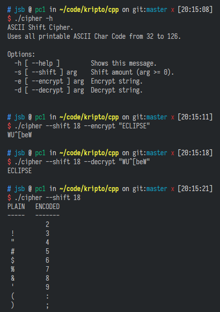

# Shift Cipher

```
Nama: Okka Riswana
NPM: 1408
```


Implementasi *shift cipher* menggunakan C++17. Semua karakter *printable* dalam ASCII digunakan (kode 32 sampai 126).

## Kompilasi

Program ini memiliki dependensi untuk opsi CLI pada [Boost Program Options](https://www.boost.org/doc/libs/1_74_0/doc/html/program_options.html).

```
clang++ -std=c++17 -lboost_program_options -o cipher cipher.cpp
```

## Screenshot
